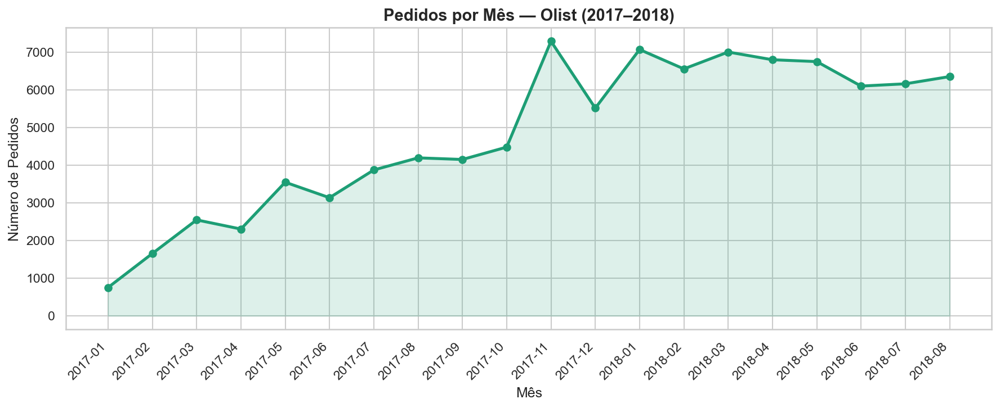
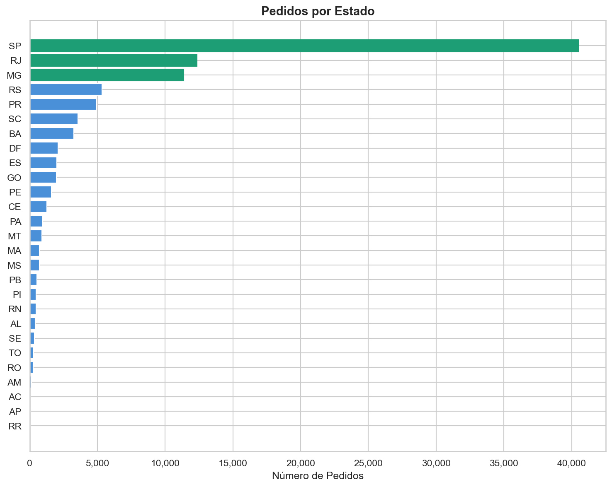
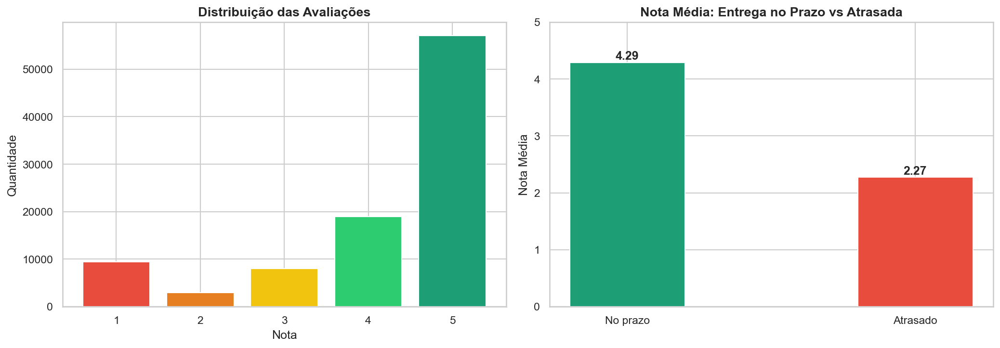
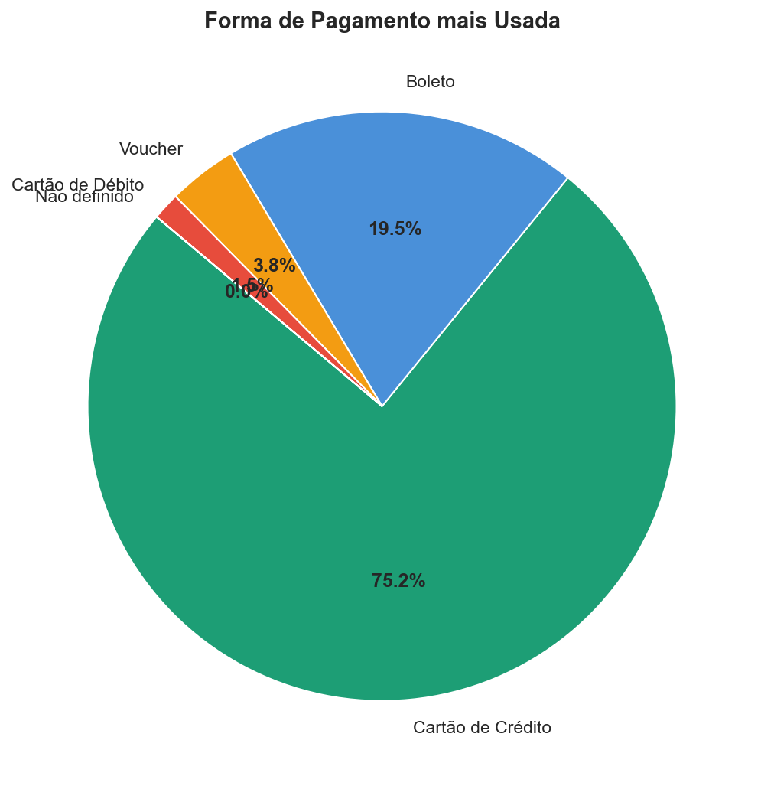
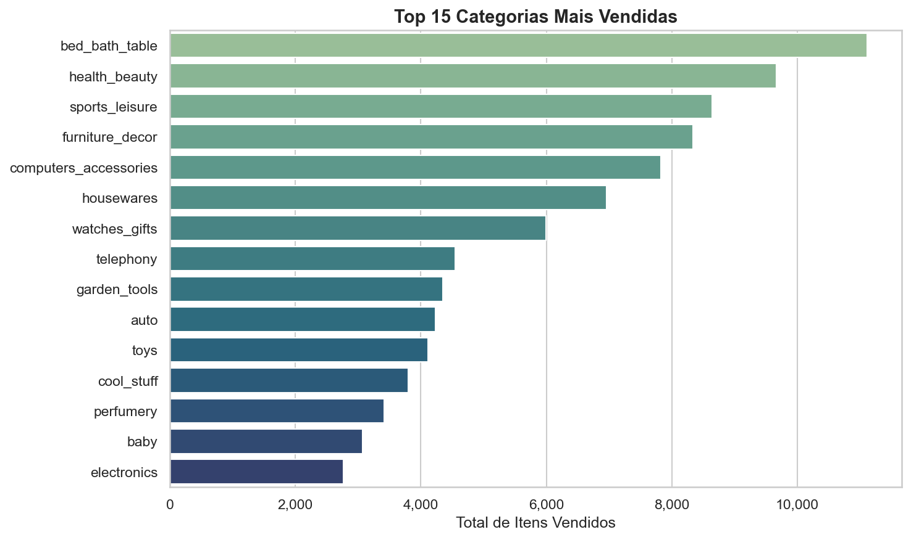

# 📦 Análise Exploratória — Olist E-Commerce

Análise exploratória completa do dataset público da Olist, maior plataforma de e-commerce do Brasil, com dados reais de **2016 a 2018**.

---

## 🎯 Objetivo

Entender o comportamento de vendas, satisfação do cliente e performance de entrega, respondendo perguntas de negócio relevantes a partir dos dados.

---

## 🗂️ Fonte dos Dados

- **Dataset:** [Brazilian E-Commerce Public Dataset by Olist](https://www.kaggle.com/datasets/olistbr/brazilian-ecommerce)
- **Plataforma:** Kaggle
- **Período:** 2016 – 2018
- **Volume:** ~100 mil pedidos reais

---

## ❓ Perguntas Respondidas

1. Quantos pedidos por mês? Houve sazonalidade?
2. Quais estados do Brasil compram mais?
3. Qual a nota média de avaliação dos clientes?
4. Atrasos na entrega impactam a avaliação?
5. Qual a forma de pagamento mais usada?
6. Quais categorias de produto mais vendem?

---

## 💡 Principais Insights

| Insight | Valor |
|---|---|
| Total de pedidos entregues | 96.478 |
| Mês com mais pedidos | Novembro/2017 (Black Friday) |
| Estado que mais compra | SP (40.501 pedidos) |
| Nota média geral | 4.16 / 5.00 |
| Nota com entrega no prazo | 4.29 / 5.00 |
| Nota com entrega atrasada | 2.27 / 5.00 |
| Forma de pagamento #1 | Cartão de Crédito (75.2%) |
| Categoria mais vendida | Cama, Mesa e Banho (11.115 itens) |

> 🔍 **Destaque:** Pedidos atrasados têm nota média 2 pontos abaixo dos entregues no prazo (2.27 vs 4.29), mostrando que a experiência de entrega é o principal fator de satisfação do cliente.

---

## 📊 Visualizações

| Gráfico | Descrição |
|---|---|
|  | Evolução mensal de pedidos |
|  | Ranking de estados por volume |
|  | Distribuição de notas e impacto de atrasos |
|  | Formas de pagamento mais usadas |
|  | Top 15 categorias mais vendidas |

---

## 🛠️ Tecnologias Utilizadas

- **Python 3.14**
- **pandas** — manipulação e limpeza dos dados
- **matplotlib / seaborn** — visualizações
- **Jupyter Notebook** — ambiente de análise
- **Looker Studio** — dashboard interativo (em breve)

---

## 📁 Estrutura do Repositório

```
olist-ecommerce-analysis/
├── data/                  # Datasets originais do Kaggle
├── olist_analise_exploratoria.ipynb  # Notebook completo
├── grafico_*.png          # Gráficos gerados
├── export_*.csv           # Dados tratados para o dashboard
└── README.md
```

---

## ▶️ Como Rodar

1. Clone o repositório:
```bash
git clone https://github.com/dionesantoss/olist-ecommerce-analysis.git
```

2. Instale as dependências:
```bash
pip install pandas matplotlib seaborn
```

3. Baixe o dataset no [Kaggle](https://www.kaggle.com/datasets/olistbr/brazilian-ecommerce) e coloque os CSVs na pasta `data/`

4. Abra e rode o notebook `olist_analise_exploratoria.ipynb`

---

## 👩‍💻 Autora

**Dione Santos**  
Analista de Dados Jr. | Python • SQL • Looker Studio  
[](https://github.com/dionesantoss)
[](https://linkedin.com/in/seu-perfil)
